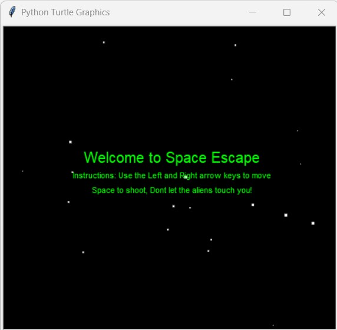
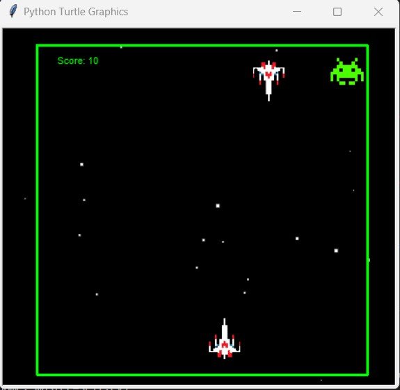

# Space Escape (The Invader's Perspective)

This is a Python game built using the Turtle library, in which the player experiences the view of the invader trying to avoid shoots of the feared imperial troops. The game is a rebuilt of Space Invader with a different approach.

## Prerequisites
- Python 3.x
- Turtle library

## How to Play
- Clone the repository to your local machine
- Run `python3 main.py` on your terminal
- Use the left and right arrow keys to move the invader and avoid the imperial troops' shoots
- The game is over when the invader collides with the shoots or reaches the top of the screen

## Game Features
- The invader moves horizontally using the arrow keys
- The imperial troops shoot randomly from the top of the screen
- The game keeps track of the player's score
- The game has sound effects

## Credits
- This game was inspired by Space Invaders
- A Code-it-Hacks experience

## Screenshots

